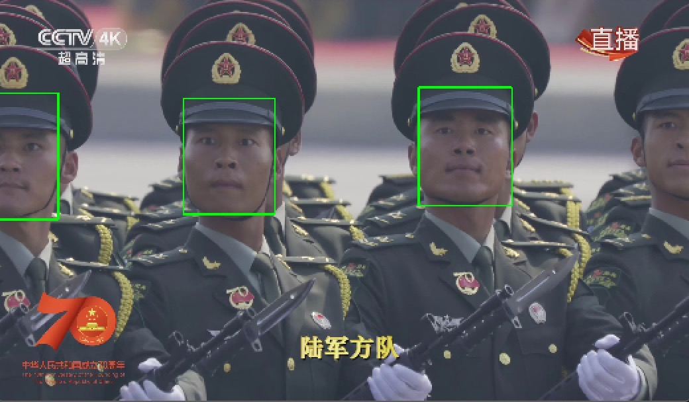

# face_demo_client

AI 人脸识别客户端，用来显示实时流和检测结果
1. 支持直接拉流RTSP播放。
2. 支持BITMAIN 人脸识别服务端，接受发送的网络流，并画出人脸框。
3. 支持其他类型的检测画图，如OpenPose

目前支持的检测应用列表如下：
|应用名称 | 简单介绍 |
|---|---|  
|人脸检测和追踪 | 支持叠加人脸检测框到实时视频
|人体骨骼检测 | 支持叠加骨骼显示到实时视频
|对象检测 | 支持检测框叠加到实时视频

需要配合使用如下程序来进行全流程演示：https://github.com/sophon-ai-algo/examples/tree/main/inference
# 编译方法

> Linux平台依赖库安装:  
> sudo apt install qtbase5-dev

> MAC平台依赖库安装：请下载QT安装程序手动安装。   
> Windows平台依赖库：ffmpeg，opencv  

修改CMakeLists.txt中OpenCV_DIR为实际安装目录，并指定到cmake目录. windows下需要将编译好的库放到c:\\dev目录下。 需要读者对cmake有一定的了解。  

> mkdir build   
> cd build
> cmake ..   
> make -j4   
> ./build/bin/face_detect_client

